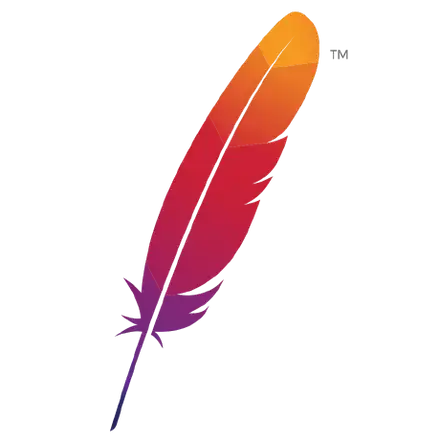
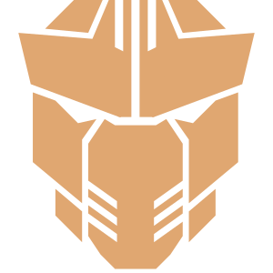
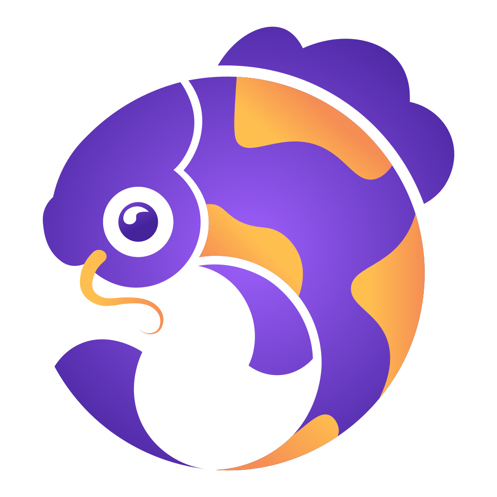

Below are projects in which I have been actively involved in various capacities:

  

    
  

  
[PrimeFaces](https://github.com/primefaces/primefaces) is one of the most popular UI libraries in Java EE Ecosystem and widely used by software companies, world renowned brands, banks, financial institutions, insurance companies, universities and more.{""}

  

    
  

  
[PrimeReact](https://github.com/primefaces/primereact) is the most complete React UI component library.{""}

  

    
  

  
[MyFaces](https://github.com/apache/myfaces) is Apache's implementation of the JavaServer Faces (JSF) and Jakarta Faces specification.{""}

  

    
  

  
[PrimeFaces Extensions](https://github.com/primefaces-extensions/primefaces-extensions) is a community driven open source project which has an aim to be a lightweight and fast Faces component and utility library in addition to [PrimeFaces](https://github.com/primefaces/primefaces).{""}

  

    
  

  
[Quarkus](https://quarkus.io/) is a Kubernetes Native Java stack tailored for OpenJDK HotSpot and GraalVM, crafted from the best of breed Java libraries and standards.{""}

  

    
  

  
[Quarkus Faces](https://github.com/melloware/quarkus-faces) is reference application for running a Faces webapp on Quarkus using [Quarkus PrimeFaces](https://github.com/quarkiverse/quarkus-primefaces) and [Quarkus OmniFaces](https://github.com/quarkiverse/quarkus-omnifaces).{""}

  

    
  

  
[Quarkus Quinoa](https://github.com/quarkiverse/quarkus-quinoa) is a Quarkus extension which eases the development, the build and serving of single page apps (built with NodeJS: React, Angular, …) alongside Quarkus . It is possible to use it with a Quarkus backend in a single project.{""}

  

    
  

  
[Quarkus Mailpit](https://github.com/quarkiverse/quarkus-quinoa) is a Quarkus extension that lets you utilize [Mailpit](https://github.com/axllent/mailpit) as a DevService for the Quarkus Mailer enabling zero-config SMTP for testing or running in dev mode. Mailpit acts as an SMTP server, provides a modern web interface to view and test captured emails, and contains an API for automated integration testing.{""}

  

    
  

  
[Quarkus Antivirus](https://github.com/quarkiverse/quarkus-antivirus) is a Quarkus extension that enables file scanning for viruses with its adaptable engine architecture. It comes pre-configured to support [ClamAV](https://www.clamav.net/) and [VirusTotal](https://www.virustotal.com/).{""}

  

    
  

  
[Orval](https://github.com/anymaniax/orval) is able to generate client with appropriate type-signatures (TypeScript) from any valid OpenAPI v3 or Swagger v2 specification, either in yaml or json formats. Generate, valid, cache and mock in your React, Vue, Svelte and Angular applications all with your OpenAPI specification..{""}

