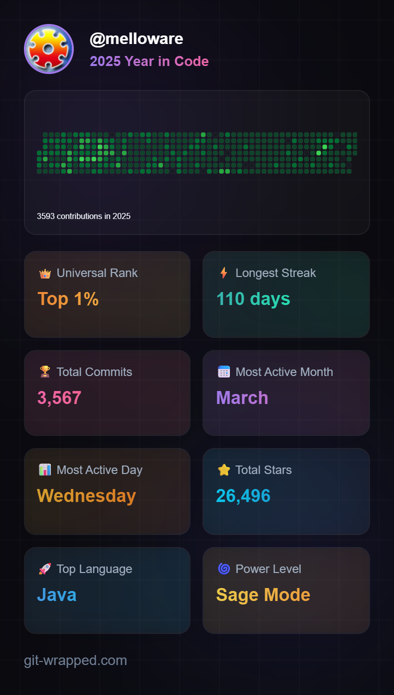

GitHub Wrapped 2025 was a reminder that open source is never a solo sport for me—it’s deeply connected to the amazing clients I get to work with every day. Many of the fixes, improvements, and bug squashes I contributed this year started as real-world problems my clients ran into, and their support gives me the space to turn those challenges into upstream improvements. By backing my work, they’re not just improving their own systems—they’re helping make the broader open source ecosystem more stable, more reliable, and better for everyone.

