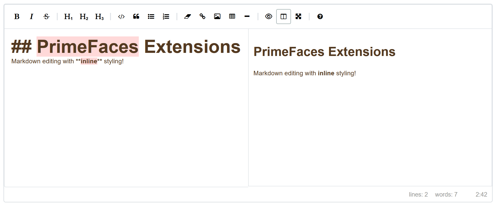

This announcement highlights the significant updates in PrimeFaces and Extensions version 14.0.0.
For a comprehensive list of new features, refer to the [What's New](https://primefaces.github.io/primefaces/14_0_0/#/gettingstarted/whatsnew) page linked here.
Additionally, if you're upgrading from an earlier version, it's crucial to review the [Migration Guides](https://primefaces.github.io/primefaces/14_0_0/#/../migrationguide/migrationguide).

> **Caution:** Java 11 and JSF 2.3 are now the minimum requirements!

## New Charts.js Component

A new more flexible version of [Chart.js](https://www.chartjs.org/) can be used `<p:chart>` allowing raw JSON or [XDEV Chart.js Java Model](https://github.com/xdev-software/chartjs-java-model).
Previously, PrimeFaces maintained distinct components for charts, such as `<p:barChart>` and `<p:pieChart>`. However, the team faced challenges
in synchronizing the Java model with Chart.js updates, which proved to be quite burdensome. With the introduction of these new components,
users now have the freedom to utilize their custom JSON data, enabling the creation of various chart types. Moreover, these components
offer flexibility by supporting third-party Java libraries like [XDEV Chart.js Java Model](https://github.com/xdev-software/chartjs-java-model), ensuring that the model remains current.
In the examples below using either backing bean value or inline JSON to configure the same chart.

```xml
<!-- use backing bean created JSON to configure the chart -->
<p:chart value="#{chartView.barModel}" style="width: 100%; height: 500px;">
   <p:ajax event="itemSelect" listener="#{chartView.itemSelect}" update="growl"/>
</p:chart>

<!-- use inline JSON with the "value" facet -->
<p:chart style="width: 100%; height: 500px;">
   <f:facet name="value">
   {
     type: 'bar',
     data: {
       labels: ['Red', 'Blue', 'Yellow', 'Green', 'Purple', 'Orange'],
       datasets: [{
         label: '# of Votes',
         data: [12, 19, 3, 5, 2, 3],
         borderWidth: 1,
         backgroundColor: ['DarkRed', 'CornflowerBlue', 'Gold', 'Lime', 'BlueViolet', 'DarkOrange']
       }]
     }
   }
   </f:facet>
</p:chart>
```

## Apache ECharts

[Apache ECharts](https://echarts.apache.org/) is an open-sourced JavaScript visualization tool, which can run fluently on PC and mobile devices.
ECharts depends on ZRender, a graphic rendering engine, to create intuitive, interactive, and highly-customizable charts.
Despite PrimeFaces already offering support for Chart.js, the allure of this charting library was too strong to resist developing a Faces component for it.
The structure of this component closely mirrors that of the new Chart.js component, except it is denoted by `<pe:echart>`.
I suggest exploring their [abundance of examples](https://echarts.apache.org/examples/en/index.html) to see the full capabilities of this advanced charting library.

Here is a Gauge chart which can replace the legacy jqPlot MeterGauge that PrimeFaces used to have.


## One Time Passcode Input

A one-time password (OTP), also known as a one-time PIN, one-time authorization code (OTAC) or dynamic password, is a password that is valid for only one login session or transaction, on a computer system or other digital device.

```xml
<pe:inputOtp length="6" integerOnly="true" value="#{controller.pin}"/>
```


## Place Geocoder Input

InputPlace is a component to wrap [Google Places](https://developers.google.com/maps/documentation/javascript/place-autocomplete) or [Azure Maps](https://learn.microsoft.com/en-us/rest/api/maps/search/get-search-fuzzy) AutoComplete functionality.
You can use autocomplete to give your applications the type-ahead-search behavior of the maps search field. The autocomplete service can match on full words and substrings, resolving place names, addresses, and plus codes.
Applications can therefore send queries as the user types, to provide on-the-fly place predictions.

```xml
<pe:inputPlace value="#{controller.input}"
    placeholder="Enter a location"
    restrictCountries="us,ca,mx"
    restrictTypes="poi"
    apiType="azure"
    apiKey="#{controller.azureApiKey}">
    <p:ajax event="placeChanged" listener="#{controller.onPlaceChanged}" />
</pe:inputPlace>
```


## ClockPicker

ClockPicker is a highly configurable component to integrate time inputs (hours / minutes) in a convenient way.
Based on [clockpicker](https://weareoutman.github.io/clockpicker/) JS library by weareoutman.

```xml
<pe:clockpicker autoClose="false" value="#{controller.time}" showOn="button">
   <p:ajax listener="#{controller.showTime}" />
</pe:clockpicker>
```


## Markdown Editor

Based on [EasyMDE](https://github.com/Ionaru/easy-markdown-editor) by Sparksuite, Inc, Jeroen Akkerman. A text area replacement for writing beautiful and understandable Markdown.
This component allows users who may be less experienced with Markdown to use familiar toolbar buttons and shortcuts. In addition, the syntax is rendered while editing to clearly show the expected result.
Headings are larger, emphasized words are italicized, links are underlined, etc. The editor is entirely customizable, from theming to toolbar buttons and javascript hooks.

```xml
<pe:markdownEditor value="#{controller.markdown}" maxHeight="300px"
    mode="sidebyside" sideBySideFullscreen="false"
    toolbar="bold, italic, strikethrough, |, heading-1, heading-2, heading-3,|, code, quote, unordered-list, ordered-list,|, clean-block, link, image, table, horizontal-rule,|, preview, side-by-side, fullscreen, |, guide">
    <p:ajax event="paste" listener="#{markdownEditorController.onPaste}"/>
</pe:markdownEditor>
```



## SunEditor

Based on [SunEditor](https://github.com/JiHong88/suneditor ) by Yi JiHong. The SunEditor is a lightweight, flexible, customizable WYSIWYG text editor for your web applications.
Many of you might be curious about why CKEditor was taken off Extensions. This decision was prompted by license complaints from CKEditor's 
owners. Consequently, the team opted for SunEditor, which is MIT-licensed, boasts impressive features, and stands as a worthy alternative 
to CKEditor. Version 14.0.0 introduces the capability to transmit raw HTML to the backing bean, departing from the slightly altered HTML 
format used by PF TextEditor, based on QuillJS.

```xml
<pe:sunEditor id="sunEditor" widgetVar="sunEditor" value="#{controller.html}"
  mode="#{controller.mode}" locale="#{controller.language}"
  toolbar="[['font','fontSize','formatBlock'],['paragraphStyle','blockquote'], ['bold', 'underline', 'italic', 'strike', 'subscript', 'superscript', 'removeFormat'],
  '/',['fontColor', 'hiliteColor', 'outdent', 'indent', 'align', 'horizontalRule', 'list', 'table'],
   ['link', 'image', 'audio', 'video', 'fullScreen', 'showBlocks', 'codeView', 'preview', 'print', 'save']]">
  <p:ajax event="save" listener="#{controller.onSave}" update="@this"/>
</pe:sunEditor>
```

